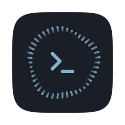

<p align="center">
  
</p>

# specrun

OpenSpec 相容的桌面 spec 管理 App。引擎完全外包 [openspec CLI](https://github.com/Fission-AI/OpenSpec)，本專案負責畫面，以及把它包成一個 macOS App。

## 安裝

**需要 Apple 晶片（M 系列）的 Mac。** 目前只發行這一種版本，Intel Mac 下載後點開會跳出「無法在這台 Mac 上開啟」的提示。

1. 到 [Releases](https://github.com/jay123578951/specrun-app/releases) 頁面下載最新的 `specrun_x.x.x_aarch64.dmg`
2. 開啟 dmg，把 `specrun.app` 拖進「應用程式」資料夾
3. 另外安裝 [openspec CLI](https://github.com/Fission-AI/OpenSpec)：`npm install -g @fission-ai/openspec@latest`（也支援 pnpm、yarn、bun、nix，見該專案的安裝說明）。specrun 本身不含這個 CLI，開啟後要靠它才讀得到 change 清單
4. 從「應用程式」資料夾第一次點開 `specrun.app`——這一步會被系統擋下，往下看

### 第一次開啟看到「已損毀，應將其丟到垃圾桶」

這句話會讓人以為檔案下載壞了，但它不是真的損毀——這個 App 沒有經過 Apple 的簽章與公證，macOS 擋下從網路下載的這類 App 時，用的就是這句嚇人的提示。

開終端機執行這一行，把 macOS 替下載檔案蓋上的標記拿掉：

```sh
xattr -d com.apple.quarantine /Applications/specrun.app
```

**執行成功時，畫面上不會出現任何訊息。** 游標直接跳回下一行就是做完了，不要以為沒生效。接著回到「應用程式」資料夾再點一次 `specrun.app`，這次就會正常開啟。

如果看到 `No such xattr`，代表你指到的那份 App 身上沒有這個標記——多半是拖曳進「應用程式」時卡在「已有同名項目」的提示、實際沒有換成新下載的那份。把舊的丟到垃圾桶，重新拖一次再試。

### 為什麼「隱私權與安全性」裡找不到「強制打開」

那個按鈕只出現在另一種情況：App 有開發者簽章、只是沒送 Apple 公證，系統認得出是誰做的，才讓你自己承擔風險放行。specrun 連開發者簽章都沒有，macOS 把它歸類成「檔案本身壞掉」，這一類不提供覆寫的選項，所以那個面板裡不會有 specrun 的紀錄，捲到底也找不到。

同理，macOS 15 之後 Finder 裡右鍵點 App 再選「打開」這條路也已經失效，不必嘗試。目前唯一的方式就是上面那行指令。

## 開發

```sh
pnpm install
pnpm dev        # web 形態：nitro (3210) + vite (5173) 併跑
pnpm dev:app    # 桌面形態：Tauri 視窗，內部自動帶起 pnpm dev
pnpm tauri build  # 打包出 .app 與 .dmg，產物在 src-tauri/target/release/bundle/
```

- `pnpm dev` 純前端工作流，不需 Rust。
- `pnpm dev:app`、`pnpm tauri build` 需要 Rust 工具鏈：`rustup` 安裝 stable 即可（https://rustup.rs）。

## 檢查

```sh
pnpm lint
pnpm typecheck
pnpm test
```
